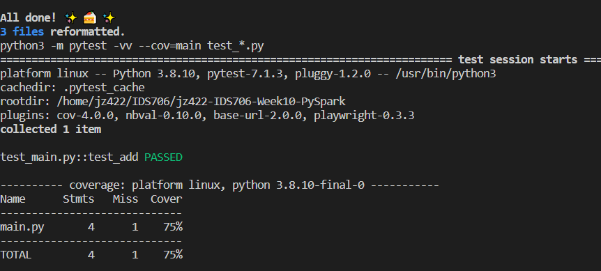
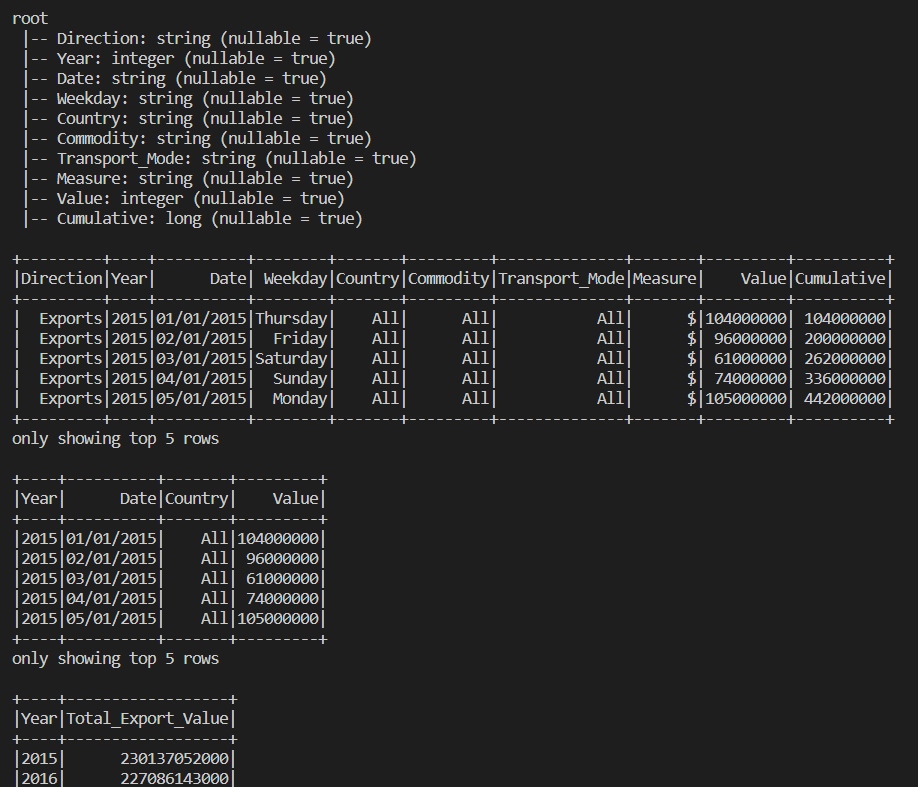

# IDS706-Week10-PySpark Data Processing Project

This repository sets up an environment on CodeSpaces and uses GitHub Actions to run a Makefile for the following commands: make install, make test, make format, and make lint.

## Overview
This project demonstrates data processing using PySpark, focusing on a dataset that details international trade activities. The main objective is to showcase the ability to perform data transformations and execute Spark SQL queries on large datasets.

## Dataset Description
The dataset used in this project contains information about trade activities, including exports and imports for various countries and commodities. Key columns in the dataset include 'Direction', 'Year', 'Date', 'Country', 'Commodity', 'Value', etc.
I get it from <https://www.stats.govt.nz/large-datasets/csv-files-for-download/>

## Installation and Setup
1. Install PySpark: If not already installed, PySpark can be installed using pip:

    pip install pyspark

2. To set up the project, simply run make all or run make install and make test.

## Features of the Script

- Data Loading and Exploration: The script starts by loading the dataset into a Spark DataFrame and displaying its schema and the first few rows.
- Data Transformation: Implements filtering and selection operations on the DataFrame to focus on specific aspects of the data.
- Spark SQL Query: A temporary view of the DataFrame is created to perform SQL queries. The script includes an example query that aggregates trade values by year.

## Output
The script outputs the results of the data transformation and the Spark SQL query, demonstrating the capabilities of PySpark in handling and analyzing large datasets.

## Project Structure
- **.devcontainer** includes a Dockerfile and devcontainer.json. The **Dockerfile** within this folder specifies how the container should be built, and other settings in this directory may control development environment configurations.
- **workflows** includes GitHub Actions, which contain configuration files for setting up automated build, test, and deployment pipelines for your project.
- **.gitignore** is used to specify which files or directories should be excluded from version control when using Git.
- **Makefile** is a configuration file used in Unix-based systems for automating tasks and building software. It contains instructions and dependencies for compiling code, running tests, and other development tasks.
- **README.md** is the instruction file for the readers.
- **requirements.txt** is to specify the dependencies (libraries and packages) required to run the project.
- **test_main.py** is a test file for main.py that can successfully run in IDEs.
- **main.py** is a Python file that contains the main function.
- **pyspark_script.py** is a Python file that contains PySpark script to perform data transformations and execute Spark SQL queries on large datasets.
